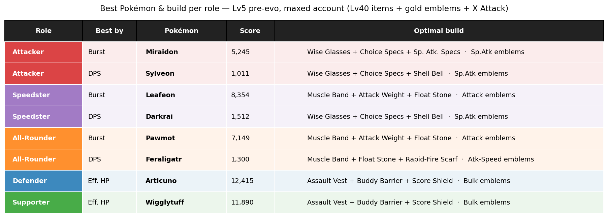
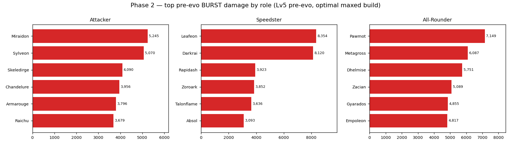
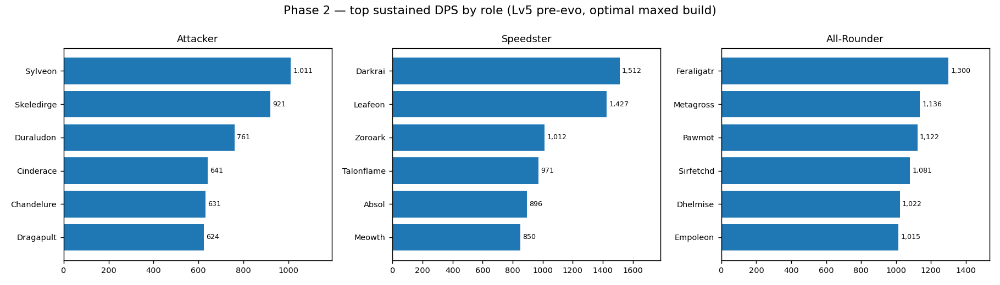
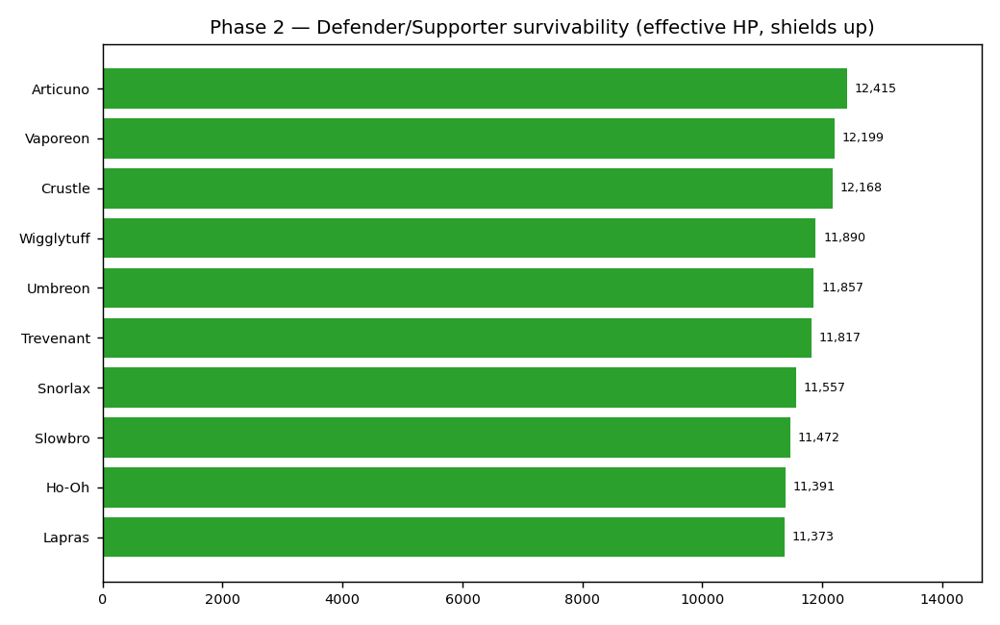
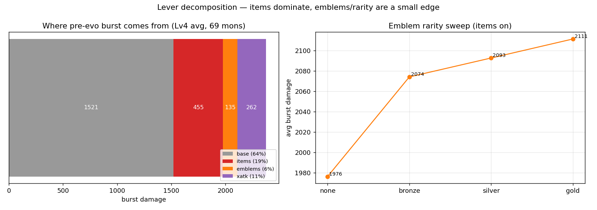
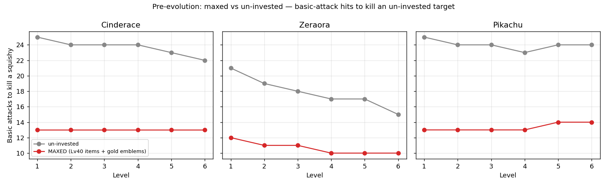
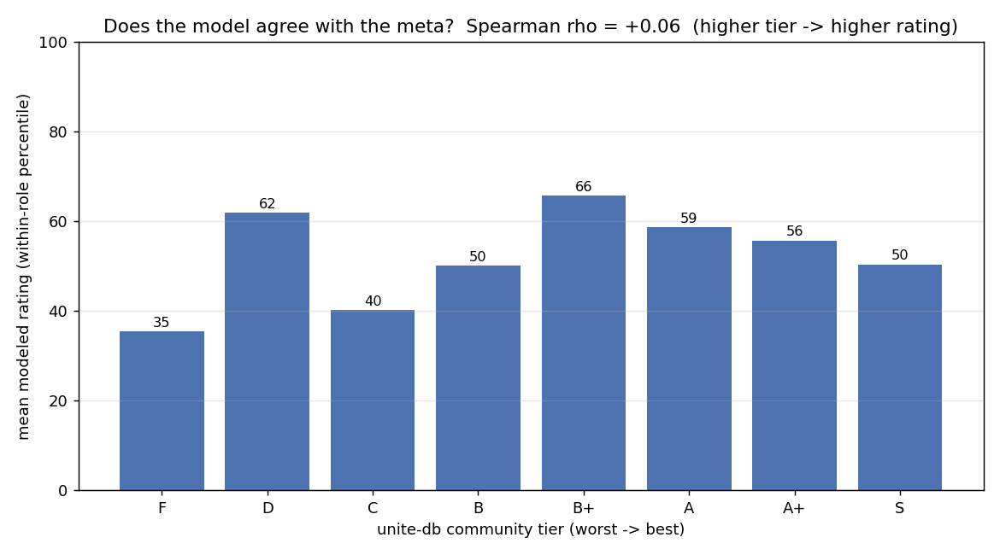

# Pokémon Unite — Stat Investment vs. Time-to-Kill

**Does maxing your account — Lv 40 held items, gold emblems, X Attack — let you delete people
*before they evolve*, regardless of which Pokémon you play?** Enemy builds are unobservable
in-game, so this answers it with a **model**: a damage / time-to-kill engine built from
*current, validated* unite-db data and the game's verified damage formula, run across the full
94-Pokémon roster — base moves, Lv5/7 upgrades, enhanced forms, multi-hit, and execute included.

## TL;DR

- 📉 **Maxed investment adds ~56% to pre-evo burst** (≈ a third less time-to-kill overall, and
  closer to *half* for pure auto-attackers) — and it holds regardless of Pokémon.
- 🔧 **Which lever?** Of that gain: **items ~53%, X Attack ~31%, emblems ~16%** — and **emblem
  rarity barely matters** (no-emblems → gold is +6.8% burst; bronze → gold is ~2%). Emblems are
  optimized over the **real 762-emblem set** (colors, grades, stat tradeoffs).
- 🧪 **Validated:** computed move damage matches **Game8 within 0.4%** across base moves *and*
  upgrades (Cinderace Pyro Ball *exactly* 1774). **22 tests green.**
- 🤔 **Honest limit:** raw combat power barely predicts the community tier (**Spearman +0.06**).
  The model nails "who hits hardest pre-evo" — but "who's actually good in ranked" is range,
  mobility, CC, objectives, and scaling, which it deliberately doesn't model.

## 🏆 Best Pokémon & build per role

Brute-forces every legal 3-item combo × emblem template per Pokémon (a maxed account), ranking
offense by **burst** and **sustained DPS** (CDR-aware), tanks/supports by **effective HP with
shields up**:



<details>
<summary>Per-role detail charts (burst · DPS · survivability)</summary>





</details>

> "Best by **modeled combat metric**" — see the meta check below for how much that actually
> predicts viability. Shields are counted "up" (situational).

## 🔧 Which lever actually matters? (the original question)



Of the **+56%** burst that investment adds over base stats (Lv 4, averaged over 69 offensive mons):
**items ~53%, X Attack ~31%, emblems ~16%.** The emblem-rarity sweep shows the jump is just
*having* a page at all (none → bronze +4.9%); **bronze → gold is ~2%**. (Emblem pages are a real
optimization over unite-db's 762 emblems — colors, grades, and stat tradeoffs included — and the
result matches the earlier template within ~1pt, so the conclusion is robust.) Practical takeaway:
**upgrade your held items first**; emblems are a small edge and their rarity is close to noise.

## 📉 Headline — investment ~halves pre-evo *auto-attack* time-to-kill

Basic attacks only (the cleanest lever view), maxed attacker vs. an un-invested squishy:

| @ Lv 3 | un-invested | maxed | reduction |
|--------|------------:|------:|----------:|
| Cinderace | 24 hits / 23.0 s | 13 hits / 11.2 s | **46% / 51%** |
| Zeraora   | 18 hits / 17.0 s | 11 hits /  9.3 s | **39% / 45%** |
| Pikachu   | 24 hits / 23.0 s | 13 hits / 11.2 s | **46% / 51%** |



(Autos are 100% stat-scaled, so investment helps them most; abilities carry a big flat/level
base, so investment is diluted there — which is why the *combined* effect is ~+56%, not ×2.)

## 🤔 Does the model agree with the meta?



**No — Spearman +0.06.** Modeled combat power does *not* predict unite-db's community tier
(best for Defenders **+0.51**, where bulk *is* the job; even slightly **negative** for Attackers).
This is the most important guardrail in the project: the engine is *accurate* (validated vs Game8)
but measures one narrow thing. "Who's actually good" depends on range, mobility, CC, objective
control, and late-game scaling — none of which this models.

## Sources & verification

- **Stats, moves & emblems — [unite-db](https://unite-db.com) raw JSON** (`/pokemon.json`,
  `/stats.json`, `/emblems.json`): the Mathcord-sourced data its site loads — 94 mons + **762
  emblems**. Its *pages* are JS-rendered (unreadable to a fetcher); the `/*.json` endpoints are raw.
  The full move kit (base + `upgrades` + `enhanced_` + multi-hit + execute + per-level
  penetration/CDR) and real emblem pages (colors / grades / stat tradeoffs) are derived from it.
  Cached in `data/unite_db_*.json`.
- **Held/battle items + emblems — [Game8](https://game8.co/games/Pokemon-UNITE/)** (Lv40 tables,
  emblem rarity + color sets), patch **v1.21.1.8 (2026-05-14)**.
- **Damage formula — reference engine** [`Stephen-Choi/...`](https://github.com/Stephen-Choi/pokemon-unite-damage-calculator):
  mitigation `floor(atk × 600/(600+Def))` + attack-speed buckets, taken verbatim. (It is *stale*
  on rebalanced moves, e.g. Electro Ball — so unite-db, validated vs Game8, is the trusted source.)
- **Validated:** `src/validate.py` reproduces Game8's published move totals within **0.4%**
  (Pyro Ball = 1774 exactly) across base + upgrade moves and multiple levels. **22 tests** cover
  the formula, Blastoise 35%, attack-speed buckets, Muscle Band cap, the move formula, and the
  Game8 cross-check.

## Run

```bash
pip install -r requirements.txt
python -m pytest tests/ -q          # 22 tests
python src/validate.py              # #1 move damage vs Game8
python src/optimize.py              # Phase 2 per-role optimizer + charts + CSV
python src/decomposition.py         # #2 lever decomposition + emblem-rarity sweep
python src/meta_validation.py       # #5 model vs community tier
python src/abilities.py             # pre/post-evo burst combos
python src/analysis.py              # Phase 1 auto-attack hits-to-kill

# Refresh data from unite-db (re-cache + regenerate the derived files):
python src/fetch_unitedb.py ; python src/parse_unitedb_moves.py ; python src/build_pokemon_from_unitedb.py
```

## Project layout

```
data/   unite_db_*.json (source) · pokemon.json / moves.json (generated) ·
        helditems / battleitems / emblems.json (Game8)
src/    stats.py · damage.py (engine) · builds.py · emblems.py (emblem optimizer) ·
        abilities.py (full-kit combat) · optimize.py (Phase 2) · decomposition.py ·
        meta_validation.py · validate.py · analysis.py ·
        fetch_unitedb / parse_unitedb_moves / build_pokemon_from_unitedb (pipeline)
tests/  engine, move-formula, and Game8-validation tests
figures/ exported charts
```

## Status & caveats

- ✅ Engine (full kit, CDR, penetration, shields) · ✅ validated vs Game8 · ✅ per-role optimizer ·
  ✅ lever decomposition · ✅ meta validation.
- **Modeled at Lv 5** by default (upgrades begin coming online); the engine handles any level.
- **Not modeled:** melee **boosted** (every-3rd) basics, **crit-damage scaling** (Scope Lens with
  high Attack), and **CC** (a stun lets the full combo land uncontested — often the real reason you
  get deleted). Shields are counted "up" (situational). The burn-DoT ratio on a couple moves
  differs ~2× from Game8 (a small secondary component).
- **Biggest caveat (measured, not assumed):** combat power weakly predicts viability (Spearman
  +0.06). Treat the per-role tables as "hardest-hitting pre-evo," not a tier list.
